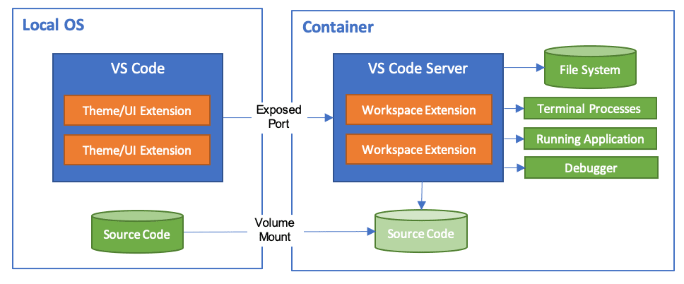

# ROS 2 + VS Code + docker using Dev Containers

A ready to use template repository for setting up ROS 2 with VS Code and Docker using Dev Containers, allowing for easy development without the need to install ROS 2 or any other tools on the host machine, but using all your favorite tools and extensions (and also GUI apps inside container!)!

Sources:
1. https://docs.ros.org/en/iron/How-To-Guides/Setup-ROS-2-with-VSCode-and-Docker-Container.html
2. https://containers.dev/guides
3. https://code.visualstudio.com/docs/devcontainers/containers



## Getting Started

### Alternative 1: Manual clone and fresh start

1. Clone this repository to your local machine and change the name to your desired project name.
```bash
git clone git@github.com:clausqr/ros2-vscode-container-dev.git my_project_name
```

2. Break the link to this repo and get rid of the images of `readme.MD`.
```bash
cd my_project_name
rm -rf .git && git init
rm readme.MD && touch readme.MD
rm img/*.png
```
### Alternative 2: 

Alternatively, if you are using github, you can select "Use this template"


and select "Create new repository" and fill in the details and start working on your new repo.


## Setting up Container Dev

1. Open the project folder in VS Code.
2. Install the Remote - Containers extension.
3. Customize `Dockerfile` according to your project needs
4. Run the `create_devcontainer.bash` script to tailor the template to your uid and gid, and also username and custom image name.
  
```bash
bash create_devcontainer.bash -h
Usage: create_devcontainer.bash [option...] {--username|-u} {--user-uid|-i} {--user-gid|-g} {--image-name|-n}

   -u, --username       Username to replace in the JSON template
   -i, --user-uid       User UID to replace in the JSON template
   -g, --user-gid       User GID to replace in the JSON template
   -n, --image-name     Image name to replace in the JSON template

If no command line arguments are provided, the values from setup.env will be used.
```

5. Build the container searching for "build container" in the command palette.
6. Alternatively, reopen the project in a container.

7. Inside the container, open a terminal and you will be in the `/ros2_ws` folder, which is mapped to the local `./ros2_ws` folder.
8. Start developing. A default `.gitignore` file is in place to ignore build artifacts and logs, which stay inside the container.
9. From there on you can develop for ROS2 without installing ROS2 or any other tool on the host:

user@host:/ros2_ws/src$ ros2
usage: ros2 [-h] [--use-python-default-buffering] Call `ros2 <command> -h` for more detailed usage. ...

ros2 is an extensible command-line tool for ROS 2.

options:
  -h, --help            show this help message and exit
  --use-python-default-buffering
                        Do not force line buffering in stdout and instead use the python default buffering, which might be affected by PYTHONUNBUFFERED/-u and depends on whatever stdout is
                        interactive or not

Commands:
  action     Various action related sub-commands
  bag        Various rosbag related sub-commands
  component  Various component related sub-commands
  daemon     Various daemon related sub-commands
  doctor     Check ROS setup and other potential issues
  interface  Show information about ROS interfaces
  launch     Run a launch file
  lifecycle  Various lifecycle related sub-commands
  multicast  Various multicast related sub-commands
  node       Various node related sub-commands
  param      Various param related sub-commands
  pkg        Various package related sub-commands
  run        Run a package specific executable
  security   Various security related sub-commands
  service    Various service related sub-commands
  topic      Various topic related sub-commands
  wtf        Use `wtf` as alias to `doctor`

  Call `ros2 <command> -h` for more detailed usage.
user@host:/ros2_ws/src$
```

## Alternative: build and run from terminal

3 convenience scripts are provided, the 3 use a single `setup.env` file to configure the user and image names. If you are running multiple instances, you can run each with a custom `instance_name` command line argument.
1. `build.bash` will build the image, run it as
```bash
bash build.bash
```
2. `run.bash` will run it mounting the local `./ros2_ws` folder to `/ros2_ws`, and it will also give you GUI pass through to your host. Run it as
```bash
bash run.bash [--name CONTAINER_NAME]
```
3. You can also open a new bash session in a running container using `join.bash`
```bash
bash join.bash [--name CONTAINER_NAME]
```


## To Do and WIP:

- [x] Squash previous WIP items.
- [x] Offload config to separate `setup.env` file.
- [x] Allow multiple instances.
- [x] Check/automate GPU handling.
- [ ] Check/automate/allow mounting devices (i.e. `/dev/ttyUSB0`).
- [ ] Integration with github codespaces (get rid of mounts for X11 and GPUs).